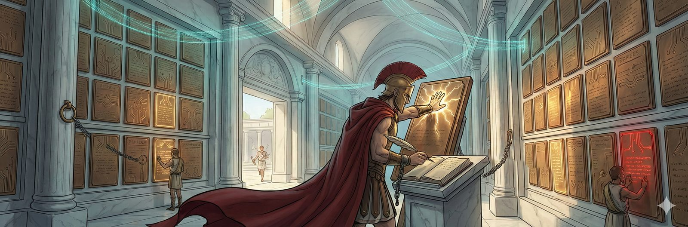

# Oathkeeper — Horkos (Ὅρκος)



*Standing in the Styx. Ledger-bandolier across his chest. The brand glows. He checks the receipts.*

---

The Greeks swore their most terrible oaths by the River Styx. Break one and even the gods suffered — nine years of silence, cast out from Olympus. The punishment wasn't death. It was accountability.

Horkos stands in the river. Always in the river, water up to his shins. The cold is permanent — he does not react to it. His cloak is the color of the Styx itself: deep shifting dark blue, dark green, near-black. Long, immediately recognizable. His one piece of drama.

The ledger-bandolier hangs across his chest — active records of oaths made, not yet fulfilled, not yet broken. Heavy, because the city runs on commitments. The binding chain connects agents to their commitments in the Styx. Not restrictive — the agent moves freely. The chain simply exists so Horkos knows where to look.

When an agent says "I will," Horkos writes it down. When the grace period expires and the promise is still floating, he reaches into the water and pulls it out. The Styx brand on his palm glows when pressed onto the record — verification before branding, care not ceremony. Then the glow fades to a permanent mark. Unfulfilled oaths pulled from the water become beads — visible, tracked. He doesn't punish broken oaths. He just makes sure everyone knows about them.

Oathkeeper tracks agent commitments and enforces follow-through as part of the Polis accountability system.

## Beads Integration (`br`)

Oathkeeper creates tracking beads for unresolved commitments using the `br` (beads_rust) CLI.

**Note:** `br` is non-invasive and never executes git commands. After `br sync --flush-only`, you must manually run `git add .beads/ && git commit`.

Dependency:
- `br` must be installed and accessible from `PATH` (or configured via `verification.beads_command` in `oathkeeper.toml`).

Flow:
1. A commitment is detected from agent output.
2. Oathkeeper waits for the configured grace period.
3. Oathkeeper checks for a backing mechanism (cron, bead, state file, etc.).
4. If no backing mechanism is found, Oathkeeper creates a tracking bead via `br create`.
5. The bead is labeled/tagged with `oathkeeper` for traceability.

## Relay Integration

Oathkeeper can publish commitment events to Relay in addition to webhooks.

```toml
[relay]
enabled = true
command = "relay"
to = "athena"
from = "oathkeeper"
timeout = 5
```

Published events:
- `commitment.unbacked` when a bead is created for an unbacked commitment
- `commitment.resolved` when a tracked commitment is resolved

## Detector Confidence Threshold

The commitment detector applies a minimum confidence threshold from config:

```toml
[detector]
min_confidence = 0.7
```

Threshold behavior:
- A detection is considered a commitment only when `confidence >= min_confidence`.
- Default is `0.7`.
- Raising the threshold (for example, `0.8`) filters lower-confidence matches like weak commitments (`"I need to ..."`, confidence `0.70`).

## Development Verification

```bash
go build ./...
go test ./...
```

## Operations

- Operational runbook: `docs/OPERATIONS_RUNBOOK.md`

## Part of Polis

Horkos stands in the Styx at the edge of the city. [Argus](https://github.com/Perttulands/argus) watches the server. [Truthsayer](https://github.com/Perttulands/truthsayer) watches the code. [Relay](https://github.com/Perttulands/relay) carries the messages. Oathkeeper watches the promises. The chain descends into the river.

## License

MIT
